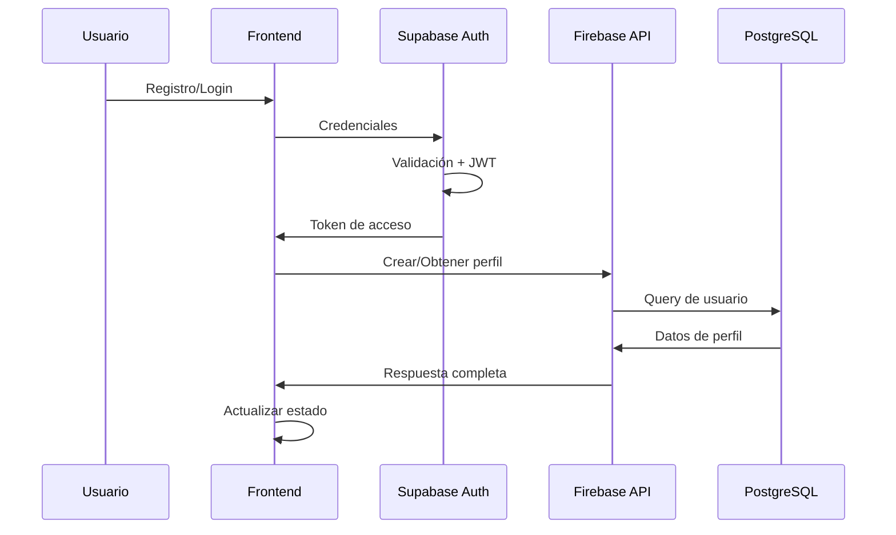

# Sistema de Autenticación - Mercado Fiel

## Resumen General

Mercado Fiel utiliza un sistema de autenticación híbrido que combina **Supabase Auth** para la gestión de identidades y autenticación, con una **base de datos PostgreSQL** (también en Supabase) para el almacenamiento de datos específicos del dominio de la aplicación.

## Arquitectura de Autenticación

### Stack Tecnológico

- **Frontend**: React + TypeScript con hooks personalizados
- **Autenticación**: Supabase Auth (gestión de usuarios, tokens JWT, verificación de email)
- **Base de datos**: PostgreSQL en Supabase (perfiles de usuario, roles, datos relacionales)
- **Estado Global**: Recoil para la gestión del estado de autenticación
- **API Backend**: Firebase Cloud Functions para lógica de negocio

### Flujo de Autenticación



## Tipos de Usuario

### 1. Clientes (Customers)
- **Descripción**: Usuarios que buscan y compran productos/servicios
- **Tabla Principal**: `clientes`
- **Campos Específicos**: `telefono`, `id_direccion`
- **Dashboard**: `/usuario-dashboard`
- **Perfil**: `/perfil-usuario`

### 2. Proveedores (Suppliers) 
- **Descripción**: Usuarios que venden productos/servicios
- **Tabla Principal**: `proveedores`
- **Campos Específicos**: `nombre_negocio`, `descripcion`, `telefono_contacto`, etc.
- **Dashboard**: `/proveedor-dashboard`
- **Perfil**: `/proveedor-perfil`

## Implementación del Sistema

### 1. Hook Principal: `useAuthSupabase`

Ubicación: `src/hooks/useAuthSupabase.ts`

**Funcionalidades principales:**
- Gestión de sesiones de Supabase
- Sincronización con base de datos PostgreSQL
- Gestión de estado con Recoil
- Mutations para registro, login, logout
- Carga de perfiles de usuario

```typescript
// Interfaces principales
interface SignInCredentials {
  email: string;
  password: string;
}

interface SignUpData {
  email: string;
  password: string;
  nombre: string;
  type: 'customer' | 'supplier';
  // Campos específicos por tipo...
}
```

**Estados Recoil gestionados:**
- `authState`: Estado general de autenticación
- `authUserState`: Datos del usuario autenticado
- `authCustomerState`: Datos específicos del cliente
- `authSupplierState`: Datos específicos del proveedor
- `authInitializedState`: Estado de inicialización
- `authLoadingState`: Estado de carga

### 2. API Backend

Ubicación: `functions/src/routes/auth.ts`

**Endpoints principales:**
- `POST /auth/signup/customer` - Registro de clientes
- `POST /auth/signup/supplier` - Registro de proveedores  
- `GET /auth/user/:email` - Obtención de usuario por email

### 3. Esquema de Base de Datos

**Tabla `usuarios` (Principal):**
```sql
model usuarios {
  id_usuario          Int       @id @default(autoincrement())
  nombre              String    @db.VarChar(100)
  email               String    @unique @db.VarChar(100)
  auth_uid            String?   @unique @db.Uuid  -- Supabase Auth UID
  contrasena_hash     String    -- Manejado por Supabase
  activo              Boolean   @default(true)
  profile_picture_url String?
  -- Relaciones
  cliente             clientes?
  proveedor           proveedores?
}
```

**Tabla `clientes`:**
```sql
model clientes {
  id_cliente     Int          @id @default(autoincrement())
  id_usuario     Int          @unique
  telefono       String?      @db.VarChar(20)
  id_direccion   Int?
  usuario        usuarios     @relation(fields: [id_usuario], references: [id_usuario])
}
```

**Tabla `proveedores`:**
```sql
model proveedores {
  id_proveedor      Int       @id @default(autoincrement())
  id_usuario        Int       @unique
  nombre_negocio    String    @db.VarChar(100)
  descripcion       String?
  telefono_contacto String?   @db.VarChar(20)
  -- Más campos específicos...
  usuario           usuarios  @relation(fields: [id_usuario], references: [id_usuario])
}
```

## Proceso de Registro

### 1. Registro de Cliente

```typescript
// 1. Crear usuario en Supabase Auth
const { data: authData, error } = await supabase.auth.signUp({
  email: email.toLowerCase(),
  password,
  options: {
    data: { nombre, user_type: 'customer' }
  }
});

// 2. Crear perfil en base de datos
await authApi.signUpCustomer({
  email, nombre, telefono
});

// 3. Sincronizar auth_uid para RLS
await AuthSyncService.syncAuthentication(authData.user);
```

### 2. Registro de Proveedor

```typescript
// Similar al cliente pero con campos específicos
await authApi.signUpSupplier({
  email, nombre, telefono_contacto,
  nombre_negocio, descripcion
});
```

## Proceso de Login

### 1. Autenticación con Supabase

```typescript
const { data, error } = await supabase.auth.signInWithPassword({
  email, password
});
```

### 2. Carga de Perfil Completo

```typescript
// Obtener datos completos desde la API
const userResponse = await authApi.getCurrentUser(email);

// Estructurar datos para el estado
const authUser: AuthUser = {
  success: userResponse.success,
  data: { ...userResponse.data, isLoggedIn: true },
  isLoggedIn: true
};
```

## Verificación de Email

### Configuración Actual

**Supabase Config (`supabase/config.toml`):**
```toml
[auth]
site_url = "http://127.0.0.1:3000"  # Local development
additional_redirect_urls = ["https://127.0.0.1:3000"]

[auth.email]
enable_confirmations = false  # Actualmente deshabilitado
```

### Templates de Email Personalizados

**Ubicación**: `emails/`
- `verify-email.html` - Template de verificación (requiere actualización)
- `style.css` - Estilos compartidos

## Seguridad y RLS

### Row Level Security (RLS)

Supabase utiliza políticas RLS para controlar el acceso a los datos:

```sql
-- Ejemplo: Los usuarios solo pueden ver sus propios datos
CREATE POLICY "Users can view own data" ON usuarios
FOR SELECT USING (auth.uid() = auth_uid);

CREATE POLICY "Users can update own data" ON usuarios  
FOR UPDATE USING (auth.uid() = auth_uid);
```

### Sincronización de Authentication

El servicio `AuthSyncService` se encarga de:
1. Vincular `auth.uid()` de Supabase con `auth_uid` en PostgreSQL
2. Garantizar que las políticas RLS funcionen correctamente
3. Mantener consistencia entre ambos sistemas

## Variables de Entorno

### Desarrollo Local
```env
VITE_SUPABASE_URL=http://127.0.0.1:54321
VITE_SUPABASE_ANON_KEY=your_local_anon_key
```

### Producción
```env
VITE_SUPABASE_URL=https://xnehuzmpesnelhdboijy.supabase.co
VITE_SUPABASE_ANON_KEY=your_production_anon_key
```

## Rutas de Autenticación

### Públicas (No requieren autenticación)
- `/` - Landing page
- `/ingresar` - Login
- `/registro` - Registro
- `/auth/callback` - Callback de Supabase

### Protegidas por Rol
- `/usuario-dashboard` - Solo clientes
- `/perfil-usuario` - Solo clientes  
- `/proveedor-dashboard` - Solo proveedores
- `/proveedor-perfil` - Solo proveedores

## Manejo de Errores

### Errores Comunes de Autenticación

1. **"Invalid login credentials"** → "Credenciales inválidas"
2. **"Email not confirmed"** → "Por favor confirma tu email"
3. **"User already registered"** → "El email ya está registrado"
4. **"Password should be at least 6 characters"** → "La contraseña debe tener al menos 6 caracteres"

### Debug y Logs

```typescript
// El hook incluye logging detallado
console.log('Starting signup process for:', email, type);
console.log('Supabase user created successfully:', authData.user?.email);
console.error('Database creation error:', dbError);
```

## Notificaciones de Usuario

El sistema utiliza notificaciones toast para informar al usuario:

```typescript
setNotification({
  open: true,
  message: '¡Cuenta creada exitosamente!',
  severity: 'success'
});
```

## Testing y Desarrollo

### Emuladores Locales
```bash
# Iniciar Supabase emuladores
supabase start

# La UI de Supabase estará disponible en:
# http://localhost:54323
```

### Reset de Base de Datos
```bash
supabase db reset
```

## Troubleshooting

### Problemas Comunes

1. **Usuario creado en Supabase pero no en PostgreSQL**
   - Verificar conectividad API
   - Revisar logs de Firebase Functions
   - Validar sincronización de `auth_uid`

2. **RLS policies no funcionan**  
   - Verificar que `auth_uid` esté sincronizado
   - Comprobar políticas en Supabase Dashboard
   - Validar token JWT

3. **Redirect URL incorrecto en emails**
   - Actualizar `site_url` en `config.toml`
   - Configurar URLs de producción en Supabase Dashboard

### URLs Importantes

- **Supabase Dashboard**: https://supabase.com/dashboard
- **Local Studio**: http://localhost:54323
- **Firebase Console**: https://console.firebase.google.com

## Próximos Pasos

1. ✅ Implementar verificación de email obligatoria
2. ✅ Crear templates de email personalizados con branding
3. ✅ Configurar URLs de redirect correctas para producción
4. ✅ Implementar reset de contraseña
5. ✅ Configurar políticas RLS y Storage
6. 🔄 Añadir autenticación de dos factores (2FA)
7. 🔄 Implementar OAuth con Google/Facebook

## 📖 Documentación Relacionada

- **[Storage Policies Setup](./STORAGE_POLICIES_SETUP.md)**: Guía paso a paso para configurar políticas de Storage
- **[PWA Configuration](./PWA_CONFIGURATION.md)**: Configuración completa de Progressive Web App

---

**Última actualización**: 26 de Septiembre, 2024
**Versión**: 1.0
**Autor**: Sistema de Desarrollo Mercado Fiel
